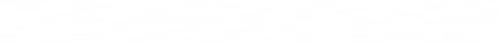
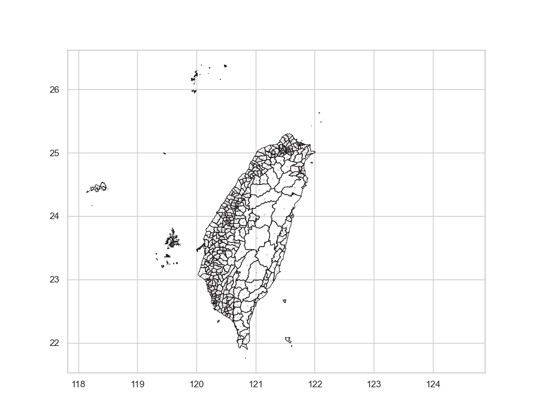
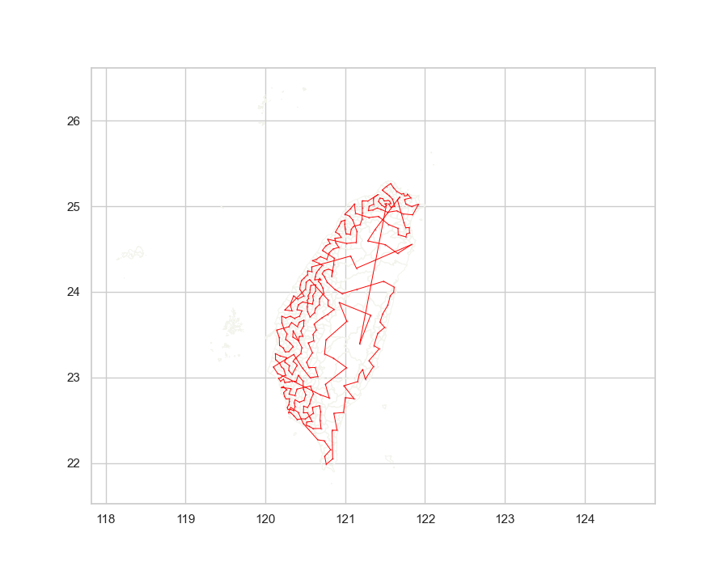

# TSP-Taiwan
## Introduction
In this project, I use several algorithms to approximate the Travelling Salesman Problem (TSP) with data from Taiwan. Since the data are real distances, the TSP problem is considered Metric TSP.

## Distance
Haversine formula : Calculate the distance between two positions with longitude and latitude.

## Algorithms 
### Nearest Neighbor (Greedy Algorithm)
This algorithm always choose the nearest unvisited neighbour as the next destination.  

### Minimum Spanning Tree (2-approximation algorithm)
The algorithm first calculate the Minimum Spanning Tree (MST), and sort the sequence of destinations with preorder traversal.

### Branch and Bound
TBD

### Christofides–Serdyukov Algorithm (1.5-approximation algorithm)
TBD

## Map

## Results - Counties
### Nearest Neighbour Algorithm
#### Google Map Plot

#### Sequence
Total Distance : 723.84 km  
Taipei -> New Taipei -> Taoyuan -> Hsinchu -> Maoli -> Taichung -> Changhua -> Nantou -> Yunlin -> Chiayi -> Tainan -> Kaohsiung -> Pingtung -> Taitung -> Hualien -> Yilan -> Keelung -> Taipei

### Minimum Spanning Tree Approximate Algorithm
#### Google Map Plot
  

#### Sequence
Total Distance : 828.43  km  
Taipei -> New Taipei -> Taoyuan -> Hsinchu -> Maoli -> Taichung -> Changhua -> Nantou -> Yunlin -> Chiayi -> Tainan -> Kaohsiung -> Pingtung -> Taitung -> Keelung -> Hualien -> Yilan -> Taipei

## Results - Towns
### Nearest Neighbour Algorithm
#### Plot 
  
Total Distance : 3333.06 km  

### Minimum Spanning Tree Approximate Algorithm

#### Plot 
  
Total Distance : 3907.32 km  

## Reference 
Data : https://data.gov.tw/dataset/25489  
Map data : https://data.gov.tw/dataset/7441  
shp Plot Reference : https://github.com/Wesely/Taiwan-Python-Map  
Haversine formula : https://en.wikipedia.org/wiki/Haversine_formula
