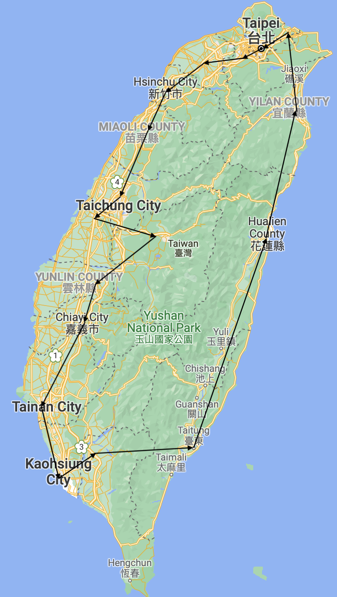
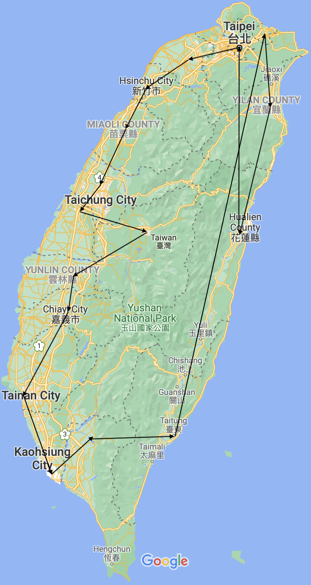

# TSP-Taiwan
## Introduction
In this project, I use several algorithms to approximate the Travelling Salesman Problem (TSP) with data from Taiwan. Since the data are real distances, the TSP problem is considered Metric TSP.

## Algorithms 
### Nearest Neighbor (Greedy Algorithm)
This algorithm always choose the nearest unvisited neighbour as the next destination.  

### Minimum Spanning Tree (2-approximation algorithm)
The algorithm first calculate the Minimum Spanning Tree (MST), and sort the sequence of destinations with preorder traversal.

### Branch and Bound
TBD

### Christofides–Serdyukov Algorithm (1.5-approximation algorithm)
TBD

## Results - Counties
### Nearest Neighbour Algorithm
#### Google Map Plot

#### Sequence
Total Distance : 723.84 km  
Taipei -> New Taipei -> Taoyuan -> Hsinchu -> Maoli -> Taichung -> Changhua -> Nantou -> Yunlin -> Chiayi -> Tainan -> Kaohsiung -> Pingtung -> Taitung -> Hualien -> Yilan -> Keelung -> Taipei

### Minimum Spanning Tree Approximate Algorithm
#### Google Map Plot
  

#### Sequence
Total Distance : 828.43  km  
Taipei -> New Taipei -> Taoyuan -> Hsinchu -> Maoli -> Taichung -> Changhua -> Nantou -> Yunlin -> Chiayi -> Tainan -> Kaohsiung -> Pingtung -> Taitung -> Keelung -> Hualien -> Yilan -> Taipei

## Results - Towns
### Nearest Neighbour Algorithm

#### Sequence
Total Distance : 6641.12 km  
0 -> 5 -> 36 -> 37 -> 25 -> 43 -> 44 -> 47 -> 46 -> 42 -> 1 -> 2 -> 3 -> 6 -> 4 -> 11 -> 27 -> 10 -> 9 -> 7 -> 8 -> 49 -> 50 -> 51 -> 20 -> 19 -> 16 -> 15 -> 12 -> 13 -> 14 -> 29 -> 17 -> 30 -> 31 -> 32 -> 53 -> 34 -> 28 -> 33 -> 38 -> 40 -> 41 -> 89 -> 87 -> 88 -> 45 -> 48 -> 93 -> 92 -> 81 -> 82 -> 83 -> 72 -> 73 -> 75 -> 79 -> 80 -> 74 -> 66 -> 68 -> 65 -> 67 -> 94 -> 95 -> 96 -> 103 -> 104 -> 98 -> 105 -> 108 -> 109 -> 101 -> 138 -> 140 -> 139 -> 125 -> 132 -> 131 -> 118 -> 119 -> 115 -> 112 -> 113 -> 116 -> 114 -> 121 -> 122 -> 169 -> 167 -> 173 -> 166 -> 210 -> 209 -> 212 -> 161 -> 158 -> 159 -> 152 -> 153 -> 155 -> 143 -> 141 -> 123 -> 142 -> 150 -> 151 -> 157 -> 160 -> 162 -> 214 -> 213 -> 202 -> 203 -> 204 -> 205 -> 206 -> 218 -> 216 -> 193 -> 191 -> 189 -> 245 -> 244 -> 251 -> 198 -> 199 -> 192 -> 217 -> 215 -> 219 -> 197 -> 201 -> 200 -> 196 -> 195 -> 181 -> 180 -> 188 -> 190 -> 194 -> 246 -> 247 -> 248 -> 236 -> 253 -> 254 -> 228 -> 255 -> 252 -> 237 -> 249 -> 242 -> 243 -> 241 -> 238 -> 239 -> 256 -> 226 -> 223 -> 220 -> 224 -> 222 -> 221 -> 233 -> 227 -> 234 -> 235 -> 229 -> 290 -> 287 -> 314 -> 313 -> 286 -> 269 -> 268 -> 285 -> 282 -> 259 -> 257 -> 258 -> 260 -> 261 -> 267 -> 265 -> 277 -> 278 -> 279 -> 280 -> 273 -> 281 -> 296 -> 274 -> 272 -> 276 -> 275 -> 288 -> 315 -> 316 -> 317 -> 318 -> 309 -> 321 -> 319 -> 322 -> 327 -> 328 -> 329 -> 332 -> 334 -> 336 -> 324 -> 323 -> 312 -> 320 -> 325 -> 326 -> 333 -> 284 -> 266 -> 263 -> 262 -> 264 -> 283 -> 330 -> 331 -> 335 -> 337 -> 339 -> 338 -> 340 -> 341 -> 357 -> 356 -> 355 -> 354 -> 346 -> 342 -> 345 -> 347 -> 348 -> 350 -> 351 -> 352 -> 370 -> 353 -> 368 -> 366 -> 365 -> 364 -> 363 -> 362 -> 361 -> 358 -> 359 -> 360 -> 172 -> 171 -> 170 -> 120 -> 117 -> 130 -> 124 -> 126 -> 127 -> 129 -> 111 -> 106 -> 100 -> 110 -> 102 -> 99 -> 97 -> 76 -> 77 -> 71 -> 69 -> 70 -> 85 -> 86 -> 84 -> 90 -> 39 -> 35 -> 56 -> 58 -> 61 -> 57 -> 60 -> 55 -> 52 -> 54 -> 26 -> 18 -> 91 -> 78 -> 59 -> 63 -> 62 -> 128 -> 107 -> 137 -> 134 -> 136 -> 135 -> 149 -> 147 -> 145 -> 146 -> 156 -> 154 -> 163 -> 165 -> 164 -> 207 -> 208 -> 144 -> 148 -> 133 -> 168 -> 174 -> 175 -> 179 -> 178 -> 211 -> 183 -> 184 -> 182 -> 186 -> 187 -> 231 -> 232 -> 292 -> 289 -> 291 -> 230 -> 250 -> 240 -> 225 -> 310 -> 311 -> 295 -> 349 -> 293 -> 294 -> 185 -> 177 -> 176 -> 367 -> 369 -> 343 -> 344 -> 300 -> 299 -> 297 -> 302 -> 301 -> 298 -> 304 -> 303 -> 305 -> 306 -> 307 -> 308 -> 23 -> 21 -> 22 -> 24 -> 64 -> 270 -> 271 -> 0

### Minimum Spanning Tree Approximate Algorithm

#### Sequence
Total Distance : 8539 km  
0 -> 1 -> 2 -> 3 -> 9 -> 7 -> 8 -> 49 -> 50 -> 51 -> 20 -> 19 -> 42 -> 46 -> 47 -> 48 -> 45 -> 4 -> 6 -> 10 -> 26 -> 18 -> 16 -> 15 -> 12 -> 13 -> 14 -> 29 -> 17 -> 30 -> 31 -> 32 -> 64 -> 53 -> 27 -> 28 -> 34 -> 54 -> 52 -> 55 -> 60 -> 57 -> 61 -> 62 -> 56 -> 35 -> 58 -> 59 -> 63 -> 11 -> 33 -> 5 -> 36 -> 37 -> 25 -> 38 -> 39 -> 40 -> 41 -> 89 -> 82 -> 81 -> 83 -> 72 -> 73 -> 75 -> 77 -> 79 -> 80 -> 74 -> 66 -> 68 -> 65 -> 67 -> 70 -> 69 -> 71 -> 96 -> 95 -> 94 -> 103 -> 104 -> 98 -> 105 -> 108 -> 109 -> 102 -> 99 -> 110 -> 100 -> 101 -> 138 -> 139 -> 125 -> 132 -> 131 -> 118 -> 119 -> 115 -> 112 -> 113 -> 120 -> 116 -> 117 -> 130 -> 124 -> 126 -> 127 -> 111 -> 106 -> 129 -> 114 -> 121 -> 122 -> 169 -> 168 -> 174 -> 175 -> 176 -> 171 -> 170 -> 172 -> 177 -> 179 -> 178 -> 123 -> 134 -> 136 -> 135 -> 149 -> 147 -> 145 -> 146 -> 156 -> 154 -> 153 -> 152 -> 159 -> 158 -> 161 -> 212 -> 209 -> 160 -> 162 -> 163 -> 165 -> 214 -> 207 -> 164 -> 204 -> 203 -> 202 -> 200 -> 201 -> 197 -> 194 -> 190 -> 195 -> 181 -> 180 -> 188 -> 196 -> 219 -> 215 -> 216 -> 193 -> 191 -> 189 -> 245 -> 244 -> 250 -> 248 -> 236 -> 252 -> 255 -> 226 -> 223 -> 220 -> 222 -> 224 -> 225 -> 221 -> 233 -> 227 -> 234 -> 235 -> 290 -> 291 -> 289 -> 295 -> 281 -> 273 -> 274 -> 275 -> 280 -> 279 -> 278 -> 277 -> 265 -> 267 -> 261 -> 260 -> 258 -> 257 -> 259 -> 263 -> 262 -> 266 -> 284 -> 333 -> 326 -> 322 -> 319 -> 318 -> 309 -> 317 -> 316 -> 315 -> 310 -> 311 -> 320 -> 321 -> 325 -> 323 -> 312 -> 355 -> 354 -> 346 -> 342 -> 343 -> 344 -> 345 -> 347 -> 348 -> 349 -> 350 -> 370 -> 352 -> 353 -> 368 -> 366 -> 365 -> 364 -> 363 -> 362 -> 361 -> 358 -> 359 -> 360 -> 367 -> 369 -> 351 -> 327 -> 324 -> 328 -> 329 -> 330 -> 331 -> 332 -> 334 -> 336 -> 335 -> 337 -> 339 -> 338 -> 340 -> 341 -> 357 -> 356 -> 282 -> 283 -> 285 -> 268 -> 269 -> 276 -> 286 -> 313 -> 314 -> 287 -> 288 -> 264 -> 272 -> 296 -> 228 -> 229 -> 256 -> 239 -> 238 -> 237 -> 249 -> 240 -> 241 -> 242 -> 243 -> 253 -> 230 -> 232 -> 231 -> 292 -> 254 -> 247 -> 246 -> 186 -> 182 -> 184 -> 183 -> 211 -> 185 -> 187 -> 294 -> 293 -> 251 -> 198 -> 199 -> 192 -> 217 -> 302 -> 297 -> 299 -> 300 -> 270 -> 271 -> 301 -> 298 -> 205 -> 206 -> 208 -> 218 -> 213 -> 155 -> 143 -> 141 -> 144 -> 150 -> 142 -> 151 -> 157 -> 166 -> 173 -> 167 -> 210 -> 148 -> 133 -> 137 -> 140 -> 308 -> 23 -> 21 -> 22 -> 24 -> 303 -> 304 -> 305 -> 306 -> 307 -> 97 -> 76 -> 78 -> 107 -> 128 -> 90 -> 91 -> 84 -> 85 -> 86 -> 87 -> 88 -> 93 -> 92 -> 43 -> 44 -> 0

## Reference 
Data : https://data.gov.tw/dataset/25489
Map data : https://data.gov.tw/dataset/7441
Shp Plot Reference : https://github.com/Wesely/Taiwan-Python-Map
